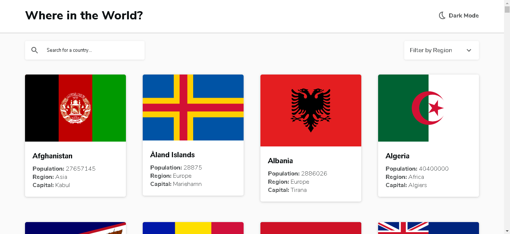
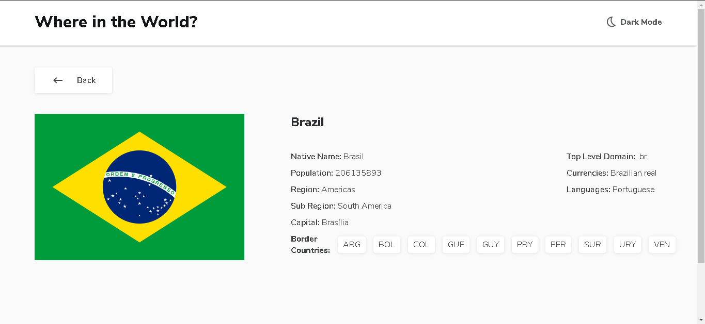
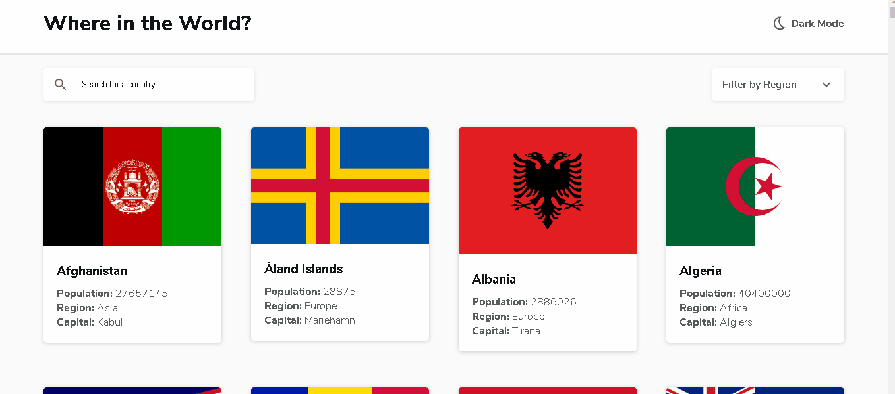

# countries-api-frontend

Solução do <a href="https://www.frontendmentor.io/challenges/rest-countries-api-with-color-theme-switcher-5cacc469fec04111f7b848ca">desafio</a> Frontend Mentor.

## Sobre:

O desafio é consumir uma API REST de paises, extrair os dados e exibilos como mostrado nos designs.

Os usuarios devem ser capazes de:  

- Ver todos os paises da API na página inicial.
- Pesquisar um pais pelo campo de busca.
- Filtrar paises por região.
- Clicar em um pais para ver informções mais detalahdas em outra página.
- Alternar o esquema de cores entre o modo escuro e claro.

## Tecnologias:

- React JS
- CSS
- Material-ui
- API: <a href="https://restcountries.eu/#rest-countries">REST Countries</a>
